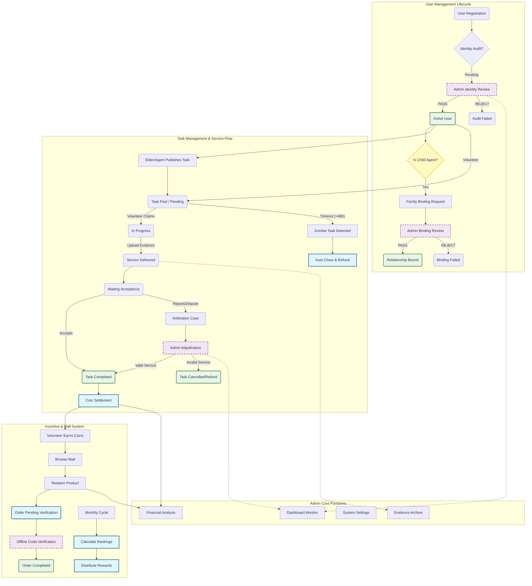

# Time Bank Admin - Functional Flow Chart

This document outlines the core functional flows of the Time Bank Administration System.

## Module Description

### 1. User Management
- **Identity Audit**: Review user real-name information and OCR data from ID cards.
- **Family Binding**: Review requests from Child Agents to bind with Elder accounts for managing tasks on their behalf.

### 2. Task Management
- **Lifecycle**: Controls the flow from task creation to completion.
- **Zombie Tasks**: Automatically identifies and closes tasks that have been pending for too long to ensure system liquidity.
- **Arbitration**: Handles disputes between Elders and Volunteers with evidence-based adjudication.

### 3. Incentive System
- **Mall**: Allows volunteers to redeem their "Time Coins" for real-world products or services.
- **Offline Verification**: Ensures physical delivery of goods through verification codes.
- **Ranking**: Monthly automated rewards for top-performing volunteers.

### 4. System Administration
- **Financial Analysis**: Monitors the economic health of the Time Bank (Minting vs. Burning of tokens).
- **Settings**: Global configuration of exchange rates, reward amounts, and fees.
